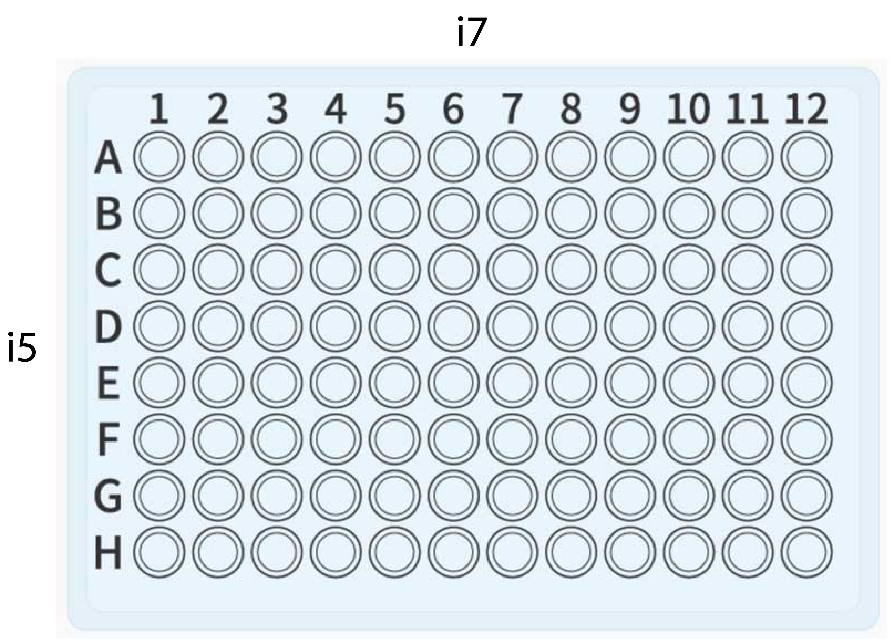

# 3RAD Lab Protocol
*Modified from the Oaks Lab protocol (https://github.com/phyletica/lab-protocols/blob/master/3rad-protocol.md)
and the BadDNA @ Univ. Georgia protocol (https://baddna.uga.edu/protocols.html)*

### 0. Quantify and Normalize Samples
Before beginning the 3RAD protocol, you will first quantify the DNA concentration of each sample
(we perform this step using a Qubit fluoremeter).

Following quantification, you will then standardize your samples to 20 ng/µL.

### 1. Digestion
*Note: Step 2 (Ligation) must occur **immediately** following Step 1.*

**Materials Needed:**
> * 20,000 U/mL New England BioLabs (NEB) Restriction Enzymes
>   * XbaI
>   * EcoRI-HF
>   * NheI-HF
> * molecular grade H2O
> * 10X NEB CutSmart Buffer
> * 2.5 µM Read 1 (i5) and Read2 (i7) Adapters
>   * *a working stock will need to be made before beginning. Our lab creates several i5 adapter sets in 8-strip PCR tubes and i7 adapter sets in a 12-strip for easy grab use. DO NOT THAW UNUSED STOCK.*
> * Standardized DNA (20 ng/µL)

*Materials Note: only take out enzymes/polymerase from freezer when they are ready to be used. Buffers for Digestion and Ligation can be thawed prior to Digestion step (at start of day)*

### 1a. Create Master Mix and Add Adapters + DNA
**Master Mix**
Enzyme Digestion | 1X | 112X
-----------------|----|-----
NEB CutSmart     |1.5 µL | 168 µL
dH2O | 3.0 µL | 336 µL
XbaI | 0.5 µL | 56 µL
EcoRI-HF | 0.5 µL | 56 µL
NheI-HF | 0.5 µL | 56 µL
**Total Volume** | **6 µL** | **672 µL**

*vortex master mix upon completion*

[Semi-Skirted PCR Plate]
1. Take a strip of eight 0.5 mL PCR tubes and pipette 82 µL into each tube to use as aliquot for use of multi-channel pipetting.

2. Place 6 µL of master mix in each well using a multi-channel pipette.

3. Place 2 µL of each adapter in correct well using a multi-channel pipette
(see image below for plate orientation).
  * use 12-channel pipette for i7 adapters.
  * use 8-channel pipette for i5 adapters.

4. Place 5 µL of DNA in each well after adding adapters using a multi-channel pipette.

5. Seal 96-well plate with adhesive film and proceed to 1b.

Per Well Total: 15 µL

### 1b. Incubate
1. Incubate samples at 37°C for 1 hour with no heated lid.
2. Spin down plate after incubation.
3. Place on ice block before proceeding with Step 2.

### 2. Ligation

**Materials Needed:**
> * molecular grade H20
> * Promega or NEB 10mM rATP
> * 10X Ligase Buffer (takes a while to thaw, so best to start at beginning on protocol.
> * 400,000 U/mL NEB T4 DNA Ligase

### 2a. Create Master Mix and Add
**Master Mix**
Ligation Mix | 1X | 112X
-----------------|----|-----
dH2O     | 2.75 µL | 308 µL
rATP | 1.5 µL | 168 µL
Ligase Buffer | 0.5 µL | 56 µL
DNA Ligase | 0.25 µL | 28 µL
**Total Volume** | **5 µL** | **560 µL**

*Heat Ligase Buffer to 56-60 °C to remove precipates*

*vortex master mix upon completion*

1. Take a strip of eight 0.5 mL PCR tubes and pipette 68 µL into each tube to use as aliquot for use of multi-channel pipetting.
2. Using a multi-channel pipette, add 5 µL of the master mix to each well.
3. Seal 96-well plate with adhesive film and proceed to 2b.

Per Well Total: 20 µL

### 2b. Incubation ~ 1 hr & 20 mins
1. Incubate samples **without heated lid**
  * 2 cycles of:
    * 22 °C for 20:00
    * 37 °C for 10:00
  * 80 °C for 20:00
    * reduce to 10 °C

2. Spin down plate after incubation.

*Note: While the samples incubate, make fresh 70% EtoH for Bead Cleanup & begin Kapa Hifi Buffer Thaw*

### 3. Bead Cleanup #1

**Materials Needed:**
> * molecular grade H20
> * Omega BioTek Beads
> * 70% EtOH
> * Low EDTA TE Buffer

1. Spin down PCR product after removing from thermal cycler.
2. Pool 5 µL of each ligation product into 1.5 mL tube. You can use an eight channel pipette into 8 strip tubes and then combine the 8 tubes into a 1.5 mL tube for speed.
3. Mix pooled ligation product with **1X beads i.e. 480 µL of Beads** and vortex + spin down.
    - Sit for 5 minutes.
    - Place on magnet and wait until clear.
    - Carefully remove and discard the supernatent without disturbing the beads. ***DO NOT TOSS BEADS***
4. Wash with 70% EtOH.
    - Add 500 µL 70% EtOH and let sit for 1 minutes on magnet.
    - Pipette EtOH from tube. 
5. Repeat Step 4.
6. Spin down and pipette up last drops of ethanol with a 0.1-10uL tip.
7. Air dry by leting tube sit for 2 minutes with lid open until EtOH is gone.
8. Resuspend in 25 µL Low EDTA TE Buffer.
    - Remove from magnet, flick bead down, vortex + spin down. Make sure pellet is not sticking to side of tube.
    - Let sit for 5 minutes.
    - Place back on magnet until clear (~ 3 minutes).
    - Transfer cleaned ligation product to new tube. ***TOSS BEADS***

### 4. One Cycle PCR with iTru5-8N Primer

**Materials Needed:**
> * molecular grade H20
> * 5X Kappa HiFi Buffer
> * 10µM dNTP
> * Kappa HiFi Polymerase (HotStart)
> * 5 µM iTru5 Primer
>   * *need to make 5 µM primer beforehand (stock is at at 100 µM)*
>   * *3.75 µL Stock & 71.25 µL water*

*Note: At this point, I take all of the materials out and place into a cooling block in the fridge except for the HotStart for easy assess.*

### 4a. Create Master Mix and Add DNA. There will be 4 reactions (4 PCR tubes)
**Master Mix**
PCR Mix | 1X | 5X
-----------------|----|-----
dH2O     | 29.5 µL | 147.5 µL
Kappa Buffer | 10 µL | 50 µL
iTru5 Primer | 3 µL | 15 µL
dNTP | 1.5 µL | 7.5 µL
Kappa HiFi Polymerase | 1.0 | 5.0
**Total Volume** | **45 µL** | **225 µL**

*vortex master mix upon completion*

1. Add 45 µL of master mix to four PCR tubes.
2. Add 5 µL pooled DNA to each PCR tube.
3. Spin down tubes.

Per Tube Total: 50 µL

### 4b. Incubation ~ 10 mins
1. Incubate samples with heated lid
  * 95 °C for 2:00
  * 60 °C for 0:30
  * 72 °C for 5:00
2. Spin down PCR product after removing from thermal cycler.
3. Pool PCR products in one tube.

Tube Total: 200 µL

### 5. Bead Cleanup #2
1. Repeat steps for Bead Cleanup #1 **but use 1.5X beads**

**i.e. 300 µL of Beads**

### 6. Two Primer Amplification with P5 and iTru7 Primers
**Materials Needed:**
> * molecular grade H20
> * 5X Kappa HiFi Buffer
> * 5 µM iTru7 Primer
>     * *need to make 5 µM primer beforehand (stock is at 100 µM)*
>     * *see note in step 6a about iTru7 Primer(s)*
> * 5 µM P5 Primer
>     * *need to make 5 µM primer beforehand (stock is at 100 µM)*
> * 10µM dNTP
> * Kappa HiFi Polymerase (HotStart)

### 6a. Create Master Mix and Add DNA. There will be 4 reactions (4 PCR tubes)
**Master Mix**
PCR Mix | 1X | 5X
--------|----|-----
dH2O     | 26.5 µL | 132.5 µL
Kappa Buffer | 10 µL | 50 µL
P5 Primer | 3 µL | 15 µL
dNTP | 1.5 | 7.5
Kappa HiFi Polymerase | 1.0 | 5.0
**Total Volume** | **42 µL** | **210 µL**

*vortex master mix upon completion*

1. Add 42 µL into four PCR tubes.
2. Add 3 µL of one iTru7 Primer to one tube (repeat four times - see below).
    - **For the iTru7 Primer, you will add one indexed primer to one tube, respectively. I.e., i7 101-1 will go into tube 1, i7 101-2 will go into tube 2, etc.**
    - **WRITE IN NOTEBOOK WHAT iTru7 PRIMERS YOU USED!!**
    - **The above statement approach may vary if multiplexing more than two plates on a single run.**
    - **Make sure the primer combination you decide to use is suitable for your multiplexing strategy on a NovaSeq.**
3. Add 5 µL pooled 8N PCR product to each tube, then spin down.

Per Tube Total: 50 µL

### 6b. Incubation ~ 20 mins
1. Incubate samples with **heated lid**
  * 95 °C for 3:00
  * 6 cycles of:
    * 98 °C for 0:20
    * 60 °C for 0:15
    * 72 °C for 0:30
  * 72 °C for 5:00
2. Spin down PCR product after removing from thermal cycler.
3. Pool PCR products in one tube.

### 7. Bead Cleanup #3
1. Repeat steps for Bead Cleanup #1 **but use 2X beads** and **resuspend in 35µL of Low EDTA TE Buffer**

**i.e. 400 µL of Beads**

### 8. Size selection
1. Size select DNA using BluePippin
    -Follow BluePippen instructions.
    -Be sure to use 200µL pipette tip, not 300µL when pipetting off buffer from cassette. 

*Note: blue pippen cassettes can be stored for re-use of unused lanes*

### 9. Final Amplification with P5 and P7 Primers. There will be 4 reactions (4 PCR tubes)
**Materials Needed:**
> * molecular grade H20
> * 5X Kappa HiFi Buffer
> * 5 µM P5 Primer
> * 5 µM P7 Primer
>     * *need to make 5 µM primer beforehand (stock is at 100 µM)*
> * 10µM dNTP
> * Kappa HiFi Polymerase (HotStart)

### 9a. Create Master Mix and Add DNA
**Master Mix**
PCR Mix | 1X | 5X
--------|----|-----
dH2O     | 26.5 µL | 132.5 µL
Kappa Buffer | 10 µL | 50 µL
P5 Primer | 3 µL | 15 µL
P7 Primer | 3 µL | 15 µL
dNTP | 1.5 | 7.5
Kappa HiFi Polymerase | 1.0 | 5.0
**Total Volume** | **45 µL** | **225 µL**

*vortex master mix upon completion*

1. Add 45 µL into four PCR tubes.
2. Add 5 µL pooled 8N PCR product to each tube, then spin down.

Per Tube Total: 50 µL

### 9b. Incubation ~ 20 mins
1. Incubate samples with heated lid
  * 95 °C for 3:00
  * 6 cycles of:
    * 98 °C for 0:20
    * 60 °C for 0:15
    * 72 °C for 0:45
  * 72 °C for 5:00
2. Spin down PCR product after removing from thermal cycler.
3. Pool PCR products in one tube.

### 10. Bead Cleanup #4
1. Repeat steps for Bead Cleanup #1 **but use 1X beads**

**i.e. 200 µL of Beads**

2. **Re-suspend in 25 µL 10 mM TrisHCL buffer**.

*Note: 100 µL TrisHCL + 9,900 µL H20 = 10 mL of 10 mM TrisHCL*
